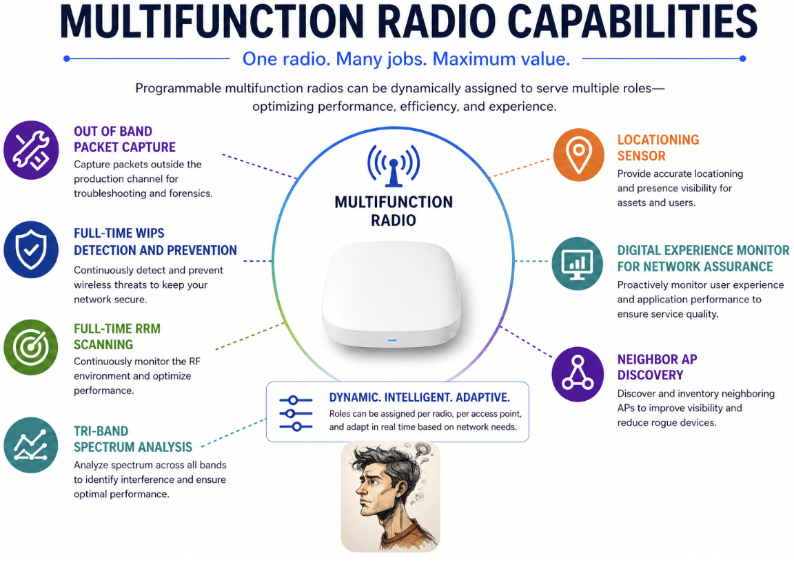
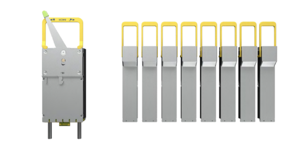
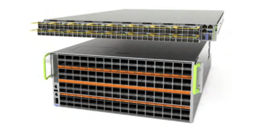
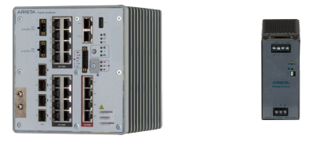
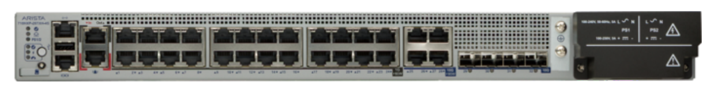

# Arista Southwest Region Newsletter

Welcome to the May 2026 Newsletter for Arista customers in the U.S. Southwest Region! 

We welcome your feedback on the newsletter. If you have any ideas or suggestions on how to improve the newsletter, please reach out to [southwest@arista.com](mailto:southwest@arista.com){: target="_blank" }.  

---

## Leadership Perspectives — Recent Blogs from Arista Leadership

-   **The Many Facets of AI Fabrics**
    ---
    *May 12, 2026: Jayshree Ullal and Hardev Singh dive into the details of AI Fabrics, focusing on scale-up, scale-out, and scale-across concepts as they relate to Back End AI Fabrics.*
    
    [Read Blog](https://blogs.arista.com/blog/the-many-facets-of-ai-fabrics){: target="_blank" }

-   **AI Datacenters are Reshaping the Optics Industry**
    ---
    *Mar 11, 2026: Andy Bechtolsheim and Vijay Vusirikala introduce XPO (eXtra-dense Pluggable Optics), a revolutionary 12.8 Tbps liquid-cooled module.*
    
    [Read Blog](https://blogs.arista.com/blog/ai-datacenters-are-reshaping-the-optics-industry){: target="_blank" }

[Explore All Blogs](https://blogs.arista.com/blog){: target="_blank" }

---

## Southwest Region Tech Tip of the Quarter

!!! info "Your new network colleague: Ask AVA"
    

    Tired of clicking through multiple dashboards to piece together a troubleshooting picture? 
    
    Meet **Ask AVA**, your new CloudVision AI colleague that allows you to interact with your network using natural language.
    
    **Why it matters:** Ask AVA leverages your high-quality data in Arista's Network Data Lake (NetDL) to answer specific questions about your network. Instead of manually correlating MAC addresses and routing tables across different screens, you can simply ask AVA to summarize active network events, generate CPU and memory visualizations, or even run `ping` and `traceroute` commands directly from impacted devices.
    
    **Pro Tip:** You can enable Ask AVA (currently in Beta) by navigating to the **Settings > Features** tab in your CVaaS tenant. Once enabled, click the **"A"** icon in the top right corner of any CloudVision screen to open the chat interface. If you are logging in after a long weekend, try starting with: "Create a list of Events that have occured over the last 24 hours and recommend which events I should address first."

    Check out last months Newsletter to learn more about Ask AVA! To view, select "March 2026" in the top left navigation menu.
    

---
## Featured Articles

### Total RF Visibility–Built In
By: Dang Nguyen, Manager, Systems Engineering 
 

Wi-Fi is grounded in science—but in practice, it behaves like an art.
Endless environmental variables make consistent performance difficult to predict and even harder to troubleshoot. There has always been a quest to bring Wi-Fi back to a more predictable science, without the impossible task of deploying engineers to vast sites or even multiple locations. In essence, how to bring more of the science and predictability back into the environment.

The aspiration of every Wi-Fi administrator is to be everywhere at once, with the ability to do live and even proactive troubleshooting of a technology when required. To gather telemetry everywhere there is an access point would be key to this capability.  For instance, the ability to sniff the RF environment while the endpoint is trying to connect, along with having an actively running separate client perform tests, has been two separate luxuries. The ability to have this in a single device, along with a host of other capabilities, has been on the wishlist of many:

 

<figure markdown="span">
  
  <figcaption>Multi-Function Radio Capabilities</figcaption>
</figure> 

 

The ability to deploy this technology cost-effectively without needing to pull in additional resources and create new LAN drops has also been a challenge.

The answer is a radio that performs all these functions in a single device. Arista solves this problem with a dedicated Multifunction Radio or MFR. The key point is that it’s detected, so the full functionality of servicing end wireless devices is never impacted, and neither is the MFR's functionality in a SINGLE access point. Time-sharing radios are a thing of the past, which forces a compromise  between full environmental scanning and servicing wireless clients.

Arista’s MFR integrates this functionality into each access point, enabling the prolific and persistent capability to capture wireless traffic, perform full-time RRM scanning, spectrum analysis, client simulation testing, neighbor Access Point discovery, location sensing, and, yes, full-time wireless detection and prevention (WIPS).

There is quite a bit to unpack here, but a key consideration is background scanning, which is what access points without an MFR provide at the expense of servicing wireless client traffic. There is much detail around Off-channel Scan Interval (OCSI),  Channel Scan Duration (CSD), and Number of Channels to Scan (NCS) = Cycle Time (CT), but this chart paints the picture of the impact of one over the others.

| Background Scanning Cycle Times   (OCSI + CSD) x NCS = CT | Multifunction Radio Scanning   (CST + CSD) x NCS = CT |
| :--- | :--- |
| 2.4 GHz Cycle Time = **~ 7 minutes** | 2.4 GHz + 5 GHz + 6 GHz = **~ 16 seconds** |
| 5 GHz Cycle Time = **~ 19 minutes** | |
| 6 GHz Cycle Time = **~ 30 minutes** | |
| **~ 30 minutes (longest band Cycle Time)** vs. | **~ 16 seconds** |

Among the many capabilities the MFR impacts, one of the most critical is WIPS. Additionally, background or time-sliced scanning will leave gaps in the information gathered, which is critical for detecting attacks or general instructions, much less a wireless one. Surveillance cameras are a great example of this. These are tasked with continuously observing an area, twenty-four hours a day, seven days a week. Not just a segment, and even worse yet, timed segments of the time. A savvy attacker, especially an AI-enabled one, can easily identify times when the camera is “off duty”. This is practically impossible if the camera, in our case, the WIPS radio, is on all the time.

All these capabilities detailed here are available from Arista’s Cognitive Wi-Fi solution, specifically from the integrated MultiFunction Radio. 

To find out more about this and what we can bring to, what is arguably the most important way to connect, please see the links below. 

* [Arista Cognitive Wi-Fi](https://solutions.arista.com/wifi_freetrial?utm_source=google&utm_medium=cpc_usQ124&utm_campaign=Q4_2023_Wi-Fi_Free_AP_Direct&utm_term=access%20point&utm_campaign=Arista+WiFi+Q124&utm_source=adwords&utm_medium=ppc&hsa_acc=8254094415&hsa_cam=20978126766&hsa_grp=158407706876&hsa_ad=689405474859&hsa_src=g&hsa_tgt=kwd-10826031&hsa_kw=access%20point&hsa_mt=b&hsa_net=adwords&hsa_ver=3&gad_source=1&gad_campaignid=20978126766&gbraid=0AAAAACqXyTcdijDilkfhPqr4cBnddbxi8&gclid=CjwKCAjwntHPBhAaEiwA_Xp6RtnvIMnDAQrGy6NGwUhL-x9L_7dxiEHzNCXEz4f5TNWb-SVJDZehyhoCPpsQAvD_BwE ){ target="_blank" }

* [Troubleshooting Wi-Fi](https://www.arista.com/en/ug-cv-cue/cv-cue-troubleshooting-wi-fi){ target="_blank" }

* [Client Connectivity Testing](https://www.arista.com/en/ug-cv-cue/cv-cue-client-connectivity-test-using-a-multi-radio-access-point ){ target="_blank" }

* [Digital Experience Monitoring](https://www.youtube.com/watch?v=_odv4OAgoZE ){ target="_blank" }

* [Clear to Send Talk on the MFR](https://www.cleartosend.net/cts-319-multi-function-radio-with-arista-networks-sponsored/ ){ target="_blank" }

---
 

### Network Hardware for the Future
By Morten Sefeld and Alex Bojko, System Engineers, Southwest Region 

 

Network hardware is constantly evolving to meet the ever-changing needs of modern networks and the businesses they serve. In this article, we will discuss two unique ways in which Arista is producing hardware to meet its customers' expectations. We will first discuss the new, high-powered 12.8 Tbps liquid-cooled optic, followed by the new CCS-710HXP series ruggedized, fanless, PoE switches. 

 

**XPO Optical Module**

Arista recently presented the XPO (eXtra-dense Pluggable Optics) at the 2026 OFC conference in Los Angeles. The revolutionary 12.8 Tbps optical module is designed to meet the extreme bandwidth and thermal demands of next-generation AI networking. Each module delivers 12.8 Tbps across 64 electrical lanes, each at 200 Gbps. Compared to traditional OSFP 1.6TB optics, the XPO module achieves a fourfold increase in modular, mix-and-match front-panel density, enabling a single-rack-unit switch to reach a massive 204.8 Tbps capacity.

 
<figure markdown="span">
  
  <figcaption>Comparison of XPO to OSFP, highlighting the density improvement of XPO compared to 8X OSFP</figcaption>
</figure> 
 

To ensure market adoption, standardization, and to address critical performance bottlenecks in AI-scale data center infrastructure, Arista organized the XPO Multi-Source Agreement (MSA), which has rapidly expanded from 40 founding members to over 100 major industry partners. This open ecosystem ensures continued development, standardization, and optics universality. XPO supports any optics solution available today or in development, including 1600G-DR, FR, LR, SR, ZR, ZR+, Coherent-Lite, and next-generation 16- and 32-channel photonics designs.

 
<figure markdown="span">
  
  <figcaption>Illustration of a 204.8Tbps switch with XPO (top) and OSFP (bottom), showing the 4X density improvement</figcaption>
</figure> 
 

A defining feature is the integrated liquid-cooled cold plate, which handles power consumption exceeding 400W. By bringing liquid cooling directly inside the module, XPO keeps components around 70°F cooler than traditional air-cooled systems, which is critical for maintaining reliability in high-intensity AI workloads. 

 

**710HXP Ruggedized Switch Series**

There has been a longstanding need for switches that can handle a wide range of conditions found outside typical IDF rooms. Various environmental factors like temperature ranges from sub zero to scorching hot, dusty conditions, vibrations, and shocks are all factors that must be addressed when designing such a device.

Arista has developed the 710HXP series switch to meet the needs of a device exposed to the wide ranges of environmental factors discussed above. The 710HXP is a ruggedized platform currently designed in two form factors. The following section provides details and images of both form factors:

| Specification | 710HXP-28TXH | 710HXP-20TNH-4S |
| :--- | :--- | :--- |
| **Switch Type** | 1RU 24-port switch | 20-port Din Rail Switch |
| **Port Configuration** | 24x 1G 60W PoE   4x 10 mGig 90W PoE   4x10G SFP+ | 16x 1G 30W PoE   4x 5 mGig 90W PoE   4x10G SFP+ |
| **Cooling** | Fanless switch | Fanless switch |
| **Power Supply** | 2 x 400W AC/HVDC | 480W AC (external) or 290W DC (external) |
| **Industrial Rating** | IP30 rating for industrial environments | IP50 rating for industrial environments |
| **Mounting** | Standard rack-mountable form factor | Din Rail mounting for industrial installations |

Both the rack-mount 710HXP-28TXH-4S and DIN rail 710HXP-20TNH-4S models deliver comprehensive PoE capabilities, advanced networking features through Arista EOS, and flexible deployment options—all while maintaining the operational consistency that makes Arista's Cognitive Campus architecture so powerful. These switches bring enterprise-grade networking capabilities to factory floors, outdoor installations, and other harsh environments.

 
<figure markdown="span">
  
  <figcaption>DIN rail mount: Arista CCS-710HXP-20TNH-4S, external power supply</figcaption>
</figure> 
 

A standout feature of these switches is Cognitive Continuous PoE, which enables powering downstream devices even when the system is rebooted on a per-port basis. The high-power 90W ports are designed for next-generation devices such as Wi-Fi 7 access points and high-powered outdoor security cameras, further showing how these devices are designed to address changes and the overall evolution of networks for years to come.

 
<figure markdown="span">
  
  <figcaption>1RU rack mount: Arista CCS-710HXP-28TXH-4S</figcaption>
</figure> 
 

Arista will continue to design and develop products that meet the needs of an ever-changing network. To learn more about the XPO optical modules and the 710HXP series switches, click the links below:

* [XPO Optical Module Whitepaper](https://www.arista.com/assets/data/pdf/Whitepapers/XPO-Whitepaper.pdf){ target="_blank" }

* [710HXP Series Switches](https://www.arista.com/assets/data/pdf/Datasheets/CCS-710HXP-Datasheet.pdf ){ target="_blank" }

---

## __*Upcoming Events*__  
Arista hosts various events throughout the year for you! Members of our team organize these informative events to showcase Arista's ability to not only help improve your network, but to also assist by providing a set of tools to improve your operations!  

Click on the boxes below to be directed to Arista's website for additional lists of Webinars and Events.

-   __Webinars__  

    --- 

    We make it easy for you to view products that are of interest, all virtually! Technical members of the team showcase outstanding explanations of the products. Click below to see our list of Webinars. 

    [Arista Webinars](https://www.arista.com/en/company/news/webinars){.md-button target="_blank"}

-   __Events__ 

    ---
    Join us in person to get a closer look at our list of products and solutions, as well as get the chance to meet members of the team. Click below to see our list of upcoming Events. 

    [Upcoming Events](https://www.arista.com/en/company/news/events){ .md-button target="_blank" }

--- 

## __*Software Updates*__

*Stay informed on the latest software updates across all Arista products and services.*

|  Software    | Version      |  Release Date |
| :-----------: | :-----------: | :-----------: |
| __EOS__           | 4.33.8M   4.22.11M   4.34.6M   4.35.4M | May 12th, 2026   May 6th, 2026   May 6th, 2026   May 23rd, 2026 |
| __CVP__           | Portal 2026.1.0   Appliance 7.1.0   Sensor 1.3.0 | March 30th, 2026   September 2nd, 2025   December 5th, 2025 |
| __DMF__           | 8.10.0 | April 22nd, 2026 |
| __CV-CUE__         | 21.0.0 | January 16th, 2026 |
| __Arista NDR__     | 5.3.5 | July 16th, 2025 |
| __TerminAttr__     | 1.42.1 | February 4th, 2026 |
| __VeloCloud SD-WAN__  Orchestrator/Gateway/Edge | 6.4.1 | December 19th, 2025 |

[View All Latest Software Updates](https://www.arista.com/en/support/software-download){: .md-button .md-button--primary target="_blank" }

---

## __* Security Advisories and Field Notices*__

*Stay informed on the latest platform security and field notice updates. For more information on Arista's statement on AI-Enhanced Security and Resilience regarding Mythos and project Glasswing, [click here.](https://www.arista.com/assets/data/pdf/glasswing/QA-Project-Mythos-Glasswing.pdf){: target="_blank" }*

### **Security Advisories**
* **Dirty Frag Vulnerability** — [Security Advisory 0138](https://www.arista.com/en/support/advisories-notices/security-advisory/24019-security-advisory-0138){: target="_blank" }   *(May 8th, 2026)*
* **Tunnel Decapsulation Configuration** — [Security Advisory 0137](https://www.arista.com/en/support/advisories-notices/security-advisory/24005-security-advisory-0137){: target="_blank" }   *(May 5th, 2026)*
* **Copy Fail Vulnerability** — [Security Advisory 0136](https://www.arista.com/en/support/advisories-notices/security-advisory/24004-security-advisory-0136){: target="_blank" }   *(May 1st, 2026)*

### **Field Notices**
* **CloudEOS Pay As You Go** — [Field Notice 0128](https://www.arista.com/en/support/advisories-notices/field-notice/24021-field-notice-0128){: target="_blank" }   *(May 11th, 2026)*
* **Default Option Change in the Access Point Upgrade Feature in CV-CUE** — [Field Notice 0127](https://www.arista.com/en/support/advisories-notices/field-notice/24016-field-notice-0127){: target="_blank" }   *(May 5th, 2026)*
* **TerminAttr** — [Field Notice 0126](https://www.arista.com/en/support/advisories-notices/field-notice/24003-field-notice-0126){: target="_blank" }   *(May 4th, 2026)*

 

[View All Latest Advisories & Notices](https://www.arista.com/en/support/advisories-notices){: .md-button .md-button--primary target="_blank" }

---

## __* Product Updates*__

*Stay up to date on all new Arista Product Releases, as well as End of Sale/End of Support Notices.*

### **New Product Releases** * **Q1 2026** — [Ask AVA - CloudVision as a Service (beta feature)](https://www.arista.io/help/articles/overview-core-tools-ask-ava){: target="_blank" }

###  **End of Sale / End of Software Support**
* **May 15th, 2026** — [VeloCloud Security VNF Services](https://www.arista.com/en/support/advisories-notices/end-of-support/24027-end-of-availability-for-velocloud-security-vnf-services){: target="_blank" } 

 

[View All Latest End of Sale & Support Notices](https://www.arista.com/en/support/advisories-notices/endofsale){: .md-button .md-button--primary target="_blank" }

---

## Did You Know? 
Arista has revamped their certifications! The new **Arista Certified Engineer (ACE)** program is now organized by specific tracks like Cloud Data Center, Campus, and Automation to better align with your job role.

[Start your ACE journey now](https://www.training.arista.com/){ .md-button .md-button--primary target="_blank" }

---

---
## *Your Southwest Regional Team is Here to Support Your Success.* 

---

  <h3 style="color: #004a99; margin-top: 0;">Let's Connect</h3>
  
Thanks for reading! Your local Arista team is here to help you navigate your evolving network needs. Reach out anytime to southwest@arista.com for more information or technical guidance. Until next month—stay connected!

  <a href="mailto:southwest@arista.com" class="md-button md-button--primary">Contact Your Local Team</a>

