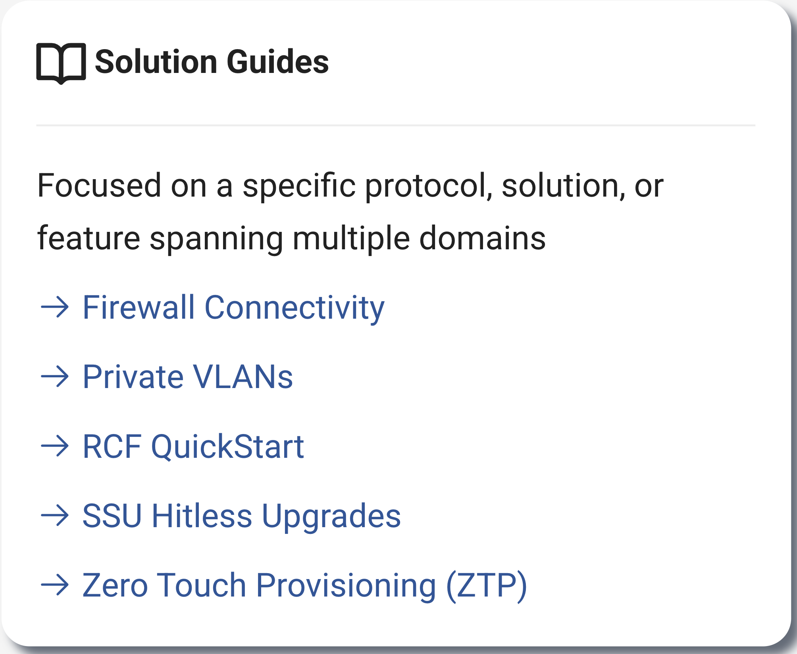
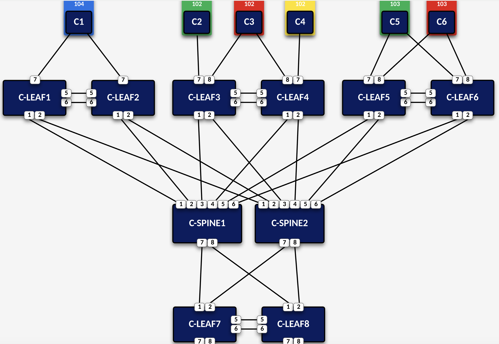

# Arista Southwest Region Newsletter

Welcome to the June 2026 Newsletter for Arista customers in the U.S. Southwest Region! 

We welcome your feedback on the newsletter. If you have any ideas or suggestions on how to improve the newsletter, please reach out to [southwest@arista.com](mailto:southwest@arista.com){: target="_blank" }.  

---

## Leadership Perspectives — Recent Blogs from Arista Leadership

-   **Three Genius Ideas for AI Fabrics**
    ---
    *June 9th, 2026: Kenneth Duda and Alan Judge detail how multi-planar leaf-spine networks, Multipath Reliable Connection (MRC), and SRv6 are transforming scale-out AI fabrics. Together, these three innovations provide massive scale, superior load balancing, and seamless resilience for the world's most advanced AI infrastructures.*
    
    [Read Blog](https://blogs.arista.com/blog/three-genius-ideas-for-ai-fabrics){: target="_blank" }

-   **The Cognitive Campus Center Journey**
    ---
    *May 26th, 2026: Kumar Srikantan and Sriram Venkiteswaran reflect on the Arista campus evolution journey that has led to Arista being named a Leader in the 2026 Gartner Magic Quadrant for Enterprise Wired and Wireless LAN.*
    
    [Read Blog](https://blogs.arista.com/blog/the-cognitive-campus-center-journey){: target="_blank" }

[Explore All Blogs](https://blogs.arista.com/blog){: target="_blank" }

---

## Southwest Region Tech Tip of the Quarter

!!! info "Your new network colleague: Ask AVA"
    

    Tired of clicking through multiple dashboards to piece together a troubleshooting picture? 
    
    Meet **Ask AVA**, your new CloudVision AI colleague that allows you to interact with your network using natural language.
    
    **Why it matters:** Ask AVA leverages your high-quality data in Arista's Network Data Lake (NetDL) to answer specific questions about your network. Instead of manually correlating MAC addresses and routing tables across different screens, you can simply ask AVA to summarize active network events, generate CPU and memory visualizations, or even run `ping` and `traceroute` commands directly from impacted devices.
    
    **Pro Tip:** You can enable Ask AVA (currently in Beta) by navigating to the **Settings > Features** tab in your CVaaS tenant. Once enabled, click the **"A"** icon in the top right corner of any CloudVision screen to open the chat interface. If you are logging in after a long weekend, try starting with: "Create a list of Events that have occured over the last 24 hours and recommend which events I should address first."

    Check out last months Newsletter to learn more about Ask AVA! To view, select "March 2026" in the top left navigation menu.
    

---
## Featured Articles

### Unlock Your Network's Potential: A Guide to the Arista Tech Library
By: Alex Bojko, Advisory Systems Engineer
 

In the fast-evolving world of cloud and AI-driven networking, staying ahead requires instant access to accurate, actionable, and deep technical knowledge. Finding relevant, detailed, accurate documentation that actually helps you understand the topic at hand can prove to be a challenge.

The Arista Tech Library was created  to be your one stop shop for relevant, accurate, and detailed documentation. More than just a repository of PDFs, the Tech Library serves as a dynamic launchpad for designing, deploying, and optimizing modern high-performance networks that follow arista best practice guidelines. 

Whether you are looking to scale out a 1600G AI fabric or secure a distributed campus network, here is a breakdown of the premier offerings available within the Arista Tech Library ecosystem.

 

**Comprehensive Design & Deployment Guides**

At the heart of the Tech Library are meticulously engineered Design and Deployment Guides. These are not just generic instruction manuals; they provide production-ready blueprints for complex network topologies.

* **Data Center & AI Fabrics:** Get step-by-step guidance on deploying cutting-edge architectures, such as standards-based BGP EVPN/VXLAN multihoming, to ensure non-blocking, line-rate performance for enterprise and public cloud scaling.

* **Cognitive Campus & WLAN:** Access deployment frameworks designed for distributed enterprise workspaces, helping you optimize wireless traffic control, achieve hitless Smart System Upgrades (SSU), as well as other campus related topics.

* **Zero-Touch Operations:** Utilize specialized zero touch workflows, such as Zero Touch Provisioning for initial device deployment and Zero Touch Replacement for day two switch swap operations (ZTP / ZTR).

 

<figure markdown="span">
  
  <figcaption>Tech Library Documentation</figcaption>
</figure> 

 

**Interactive Tech Library Labs**

Arista bridges the gap between theory and practice through new "Tech Library Labs". When reviewing a complex Deployment Guide topology, users don’t have to guess if their configuration will work. With a single click, engineers can instantiate a fully virtualized, pre-configured lab environment that mirrors the exact documentation topology. 

This hands-on sandbox allows you to take topics discussed in the deployment guides and practice implimenting those exact configuration changes using containerized EOS (cEOS) instances, before touching production hardware.

 

<figure markdown="span">
  
  <figcaption>L3LS EVPN VXLAN Deployment Guide Example Topology</figcaption>
</figure> 

 

**Knowledge Across All Network Domains**

The technical library is designed to include documentation from all network domains. This includes:

* Data Center

* Campus

* AI Center

* EOS

* Observability 

* Service Provider

* WAN

This ensures that regardless of the network domain you operate or manage, the Tech Library will have content relevant to your expertise. 

The Arista Tech Library is engineered to provide you with relevant, accurate documentation, that follows best practices and meets the needs of modern network designs and implementations. By combining traditional documentation with innovative, on-demand lab environments and a robust peer community, the Tech Library can serve as your go to destination for information spanning all network domains. 

Visit the Arista Tech Library today:

* [Arista Tech Library](https://tech-library.arista.com/ ){ target="_blank" }

*NOTE: Information contained within Tech Library is readily accessible for current Arista customers. If you are unable to access information contained within Tech Library, please reach out to your local account team for assistance.* 

---
 

## __*Upcoming Events*__  
Arista hosts various events throughout the year for you! Members of our team organize these informative events to showcase Arista's ability to not only help improve your network, but to also assist by providing a set of tools to improve your operations!  

Click on the boxes below to be directed to Arista's website for additional lists of Webinars and Events.

-   __Webinars__  

    --- 

    We make it easy for you to view products that are of interest, all virtually! Technical members of the team showcase outstanding explanations of the products. Click below to see our list of Webinars. 

    [Arista Webinars](https://www.arista.com/en/company/news/webinars){.md-button target="_blank"}

-   __Events__ 

    ---
    Join us in person to get a closer look at our list of products and solutions, as well as get the chance to meet members of the team. Click below to see our list of upcoming Events. 

    [Upcoming Events](https://www.arista.com/en/company/news/events){ .md-button target="_blank" }

--- 

## __*Software Updates*__

*Stay informed on the latest software updates across all Arista products and services.*

|  Software    | Version      |  Release Date |
| :-----------: | :-----------: | :-----------: |
| __EOS__           | 4.36.1F   4.33.7.1 | June 17th, 2026   June 16th, 2026 |
| __CVP__           | Portal 2026.1.1   Appliance 7.1.1   Sensor 1.4.1 | June 15th, 2026   April 8th, 2026   June 15th, 2026 |
| __DMF__           | 8.10.0 | April 22nd, 2026 |
| __CV-CUE__         | 21.0.0 | January 16th, 2026 |
| __Arista NDR__     | 5.3.5 | July 16th, 2025 |
| __TerminAttr__     | 1.42.1 | February 4th, 2026 |
| __VeloCloud SD-WAN__  Orchestrator/Gateway/Edge | 6.4.1 | December 19th, 2025 |

[View All Latest Software Updates](https://www.arista.com/en/support/software-download){: .md-button .md-button--primary target="_blank" }

---

## __* Security Advisories and Field Notices*__

*Stay informed on the latest platform security and field notice updates. For more information on Arista's statement on AI-Enhanced Security and Resilience regarding Mythos and project Glasswing, [click here.](https://www.arista.com/assets/data/pdf/glasswing/QA-Project-Mythos-Glasswing.pdf){: target="_blank" }*

### **Security Advisories**
* **TerminAttr** — [Security Advisory 143](https://www.arista.com/en/support/advisories-notices/security-advisory/24112-security-advisory-0143){: target="_blank" }   *(June 23rd, 2026)*
* **Next-Hop Redirection Features** — [Security Advisory 142](https://www.arista.com/en/support/advisories-notices/security-advisory/24111-security-advisory-0142){: target="_blank" }   *(June 23rd, 2026)*
* **Access Point AirSnitch Attacks** — [Security Advisory 141](https://www.arista.com/en/support/advisories-notices/security-advisory/24108-security-advisory-0141){: target="_blank" }   *(June 16th, 2026)*
* **Secure Boot** — [Security Advisory 140](https://www.arista.com/en/support/advisories-notices/security-advisory/24074-security-advisory-0140){: target="_blank" }   *(June 3rd, 2026)*

### **Field Notices**
* **Roaming for Wi-Fi 7 Windows clients with Intel BE201 adapters** — [Field Notice 130](https://www.arista.com/en/support/advisories-notices/field-notice/24110-field-notice-0130){: target="_blank" }   *(June 18th, 2026)*
* **Transmission Failures and Throughput Issues in AP Firmware 21.1.0F-81** — [Field Notice 129](https://www.arista.com/en/support/advisories-notices/field-notice/24107-field-notice-0129){: target="_blank" }   *(June 16th, 2026)*

 

[View All of the Latest Advisories & Notices](https://www.arista.com/en/support/advisories-notices){: .md-button .md-button--primary target="_blank" }

---

## __* Product Updates*__

*Stay up to date on all new Arista Product Releases, as well as End of Sale/End of Support Notices.*

### **New Product Releases** * **Q1 2026** — [Ask AVA - CloudVision as a Service (beta feature)](https://www.arista.io/help/articles/overview-core-tools-ask-ava){: target="_blank" }

###  **End of Sale / End of Software Support**
* **June 25th, 2026** — [DMF Software Support for 7260X3](https://www.arista.com/en/support/advisories-notices/end-of-support/24116-end-of-dmf-software-support-for-7260x3){: target="_blank" }
* **June 15th, 2026** — [DCS-7130-48EHS Series](https://www.arista.com/en/support/advisories-notices/end-of-sale/24106-end-of-sale-of-the-arista-dcs-7130-48ehs-series){: target="_blank" }
* **June 1st, 2026** — [DCA-300-CV](https://www.arista.com/en/support/advisories-notices/end-of-sale/24073-end-of-sale-of-dca-300-cv){: target="_blank" }

 

[View All Latest End of Sale & Support Notices](https://www.arista.com/en/support/advisories-notices/endofsale){: .md-button .md-button--primary target="_blank" }

---

## Did You Know? 
Arista has revamped their certifications! The new **Arista Certified Engineer (ACE)** program is now organized by specific tracks like Cloud Data Center, Campus, and Automation to better align with your job role.

[Start your ACE journey now](https://www.training.arista.com/){ .md-button .md-button--primary target="_blank" }

---

---
## *Your Southwest Regional Team is Here to Support Your Success.* 

---

  <h3 style="color: #004a99; margin-top: 0;">Let's Connect</h3>
  
Thanks for reading! Your local Arista team is here to help you navigate your evolving network needs. Reach out anytime to southwest@arista.com for more information or technical guidance. Until next month—stay connected!

  <a href="mailto:southwest@arista.com" class="md-button md-button--primary">Contact Your Local Team</a>

