# Arista Southwest Region Newsletter

Welcome to the April 2026 Newsletter for Arista customers in the U.S. Southwest Region! 

We welcome your feedback on the newsletter. If you have any ideas or suggestions on how to improve the newsletter, please reach out to [southwest@arista.com](mailto:southwest@arista.com){: target="_blank" }.  

---

## Featured Event

<div class="grid cards" markdown>

-   __The Future of WAN: Arista VeloCloud Unpacked - April 16th - 10AM PST__ 

    ---
    Join us for a one hour session focused on VeloCloud as part of the Arista WAN Solutions portfolio. We will show how cloud delivered SD WAN with integrated security extends Arista switching and Wi Fi so you can connect data centers, branches, and campus offices with more choice and better performance. 

    You will hear how VeloCloud fits into Arista’s branch and campus strategy and what this means for both existing customers and new prospects.

    [Sign Up Today!](https://www.arista.com/en/company/news/events){ .md-button target="_blank" }


</div>


---

## Leadership Perspectives — Recent Blogs from Arista Leadership

<div class="grid cards" markdown>

-   **AI Datacenters are Reshaping the Optics Industry***
    ---
    *Mar 11, 2026: Andy Bechtolsheim and Vijay Vusirikala introduce XPO (eXtra-dense Pluggable Optics), a revolutionary 12.8 Tbps liquid-cooled module.*
    
    [Read Blog](https://blogs.arista.com/blog/ai-datacenters-are-reshaping-the-optics-industry){: target="_blank" }

-   **Powering AI Centers with AI Spines**
    ---
    *Feb 12, 2026: Arista is pioneering the new era of AI Centers with the 7800R4. Hear from Arista CEO Jayshree Ullal about how a centralized AI Spine simplifies operations across massive 400G/800G/1.6T Etherlink fabrics.*
    
    [Read Blog](https://blogs.arista.com/blog/powering-ai-centers-with-ai-spines){: target="_blank" }


</div>

[Explore All Blogs](https://blogs.arista.com/blog){: target="_blank" }


---


## Southwest Region Tech Tip of the Month

!!! info "Your new network colleague: Ask AVA"
    <div style="font-size: 1.15em; line-height: 1.5;" markdown>
    Tired of clicking through multiple dashboards to piece together a troubleshooting picture? 
    
    Meet **Ask AVA**, your new CloudVision AI colleague that allows you to interact with your network using natural language.
    
    **Why it matters:** Ask AVA leverages your high-quality data in Arista's Network Data Lake (NetDL) to answer specific questions about your network. Instead of manually correlating MAC addresses and routing tables across different screens, you can simply ask AVA to summarize active network events, generate CPU and memory visualizations, or even run `ping` and `traceroute` commands directly from impacted devices.
    
    **Pro Tip:** You can enable Ask AVA (currently in Beta) by navigating to the **Settings > Features** tab in your CVaaS tenant. Once enabled, click the **"A"** icon in the top right corner of any CloudVision screen to open the chat interface. If you are logging in after a long weekend, try starting with: *"Show me the active network events and recommend which issues I should address first."

    Check out last months Newsletter to learn more about Ask AVA! To view, select "March 2026" in the top left navigation menu.
    </div>


---
## Featured Articles

### Level Up Your Networking Skills with Arista Academy
By: Frough Tahiry, Advisory Systems Engineer 
<br>

Are you growing tired of studying months for a certification, only to be assessed with a mundane multiple choice exam? Do you wish certification training content and exams were tailored towards what you will actually see in the field, instead of simply testing your ability to memorize terms and functions?

Introducing Arista Academy, a platform designed to help you achieve networking expertise by building practical skills that are directly applicable to your day to day tasks. Arista Academy has offered new content and courses earlier this year, with new certifications. The new Arista Academy offers various tracks from fundamentals of networking to advanced concepts of MPLS and automation, so no matter where in your networking career you are, you can find relevant courses and hands-on labs in Arista academy. 

Additionally, Arista Academy offers free classes in the Arista Academy Channels, where you can have access to hundreds of videos on networking. You can navigate to the Arista Academy Channels on the Academy’s website linked below. 

Moreover, Arista Academy also offers live classes with instructor leads and self paced classes. The courses are five days long with digital content  40 hours of hands-on-lab per sub-track and 60 hours lab time for the live classes experience included, which provides users with practical lab guides to complete as part of preparing for the lab based exam. A comprehensive datasheet for each track is available on the academy website.

Below, we will cover the four main tracks of Arista Academy in addition to the Foundations introduction level, and elaborate on the topics covered  in each track. 

<br>
**Foundations**

As the name suggests it is an essential point for building your arista expertise. This track starts from core switching all the way to automation, and introduces Arista CloudVision as well as essential security best practices.. This track offers an opportunity to learn about Layer 2 and Layer 3 forwarding , as well as Arista EOS (Extensible Operating System) Architecture with real life examples.  

<br>
**Data Center**

The Data Center track covers all the design, configuration, and troubleshooting, from basic layer two and three protocols to advanced technologies and tools that keeps a Data Center  running. 

The Data Center track is divided into two sub-tracks:

* **Data Center Engineering:** Covers Layer 2 and Layer 3 configuration via the CLI or CloudVision Studios.
* **Data Center Operations:** Focuses on Day 2 operations, such as network monitoring and troubleshooting through CloudVision.

*Note: In the self-paced section of the Academy, you will find supplemental content covering advanced topics such as VXLAN, EVPN, and Data Center Interconnection (DCI).*


<br>
**Campus**

This track provides a solid understanding of Arista campus technologies and both wired and wireless architecture. The Campus track is divided into two sub-tracks:

* **Campus Engineering:** This sub-track sheds light on Layer 2 and Layer 3 protocols for wired campuses and the fundamentals of wireless. You will also learn about Arista security solutions and approaches, and how to secure a network end-to-end via the CLI or CloudVision.
* **Campus Operations:** You will learn all Day 2 operations for wireless networks on CV-CUE and wired networks on CloudVision.

<figure markdown="span">
  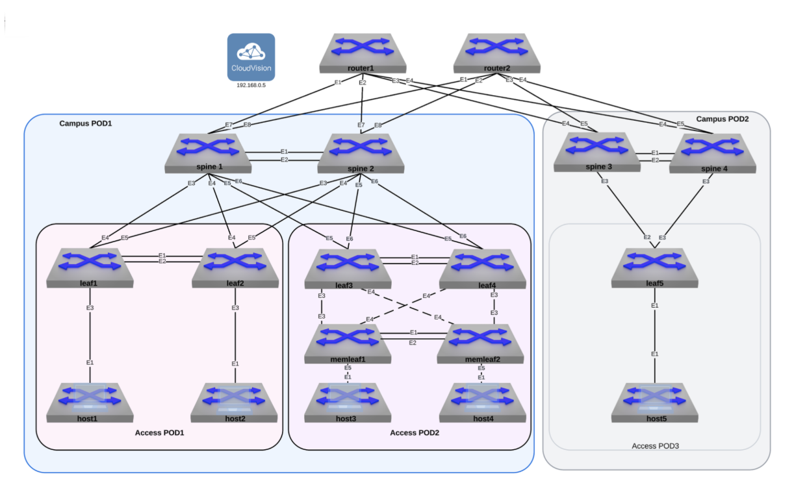
  <figcaption>Example Campus Topology from the Campus Operations Lab Guide</figcaption>
</figure> 

<br>

**MPLS WAN**
<br>

MPLS WAN, also known as Routing, is a  track designed for mid - advanced networking engineers. This track covers advanced concepts of MPLS and Arista's routing technologies and architectures applicable to Data Center, service provider, and edge networks.

<br>

**Automation**
<br>

The Automation Track is designed for network engineers, administrators, and automation-focused IT professionals who want hands-on experience with Arista automation. This track discusses the onboarding day 0 to day 2 operations and monitoring.  This track provides students with tools like Git, Jinja, CVP, Python, Ansible, and CloudVision to gain practical skills on building practical automation workflow and learn more about advanced EOS features. 

<br>

Lastly, you can enhance a valid certification by passing exams associated with each track. You can take exams for each sub-track and get a specialist certificate or you can take a test for each track and get a professional certificate. The exam is an assessment of all the concepts covered in each track, and a test of your practical skills. The exams are a hands-on lab exam for each certification and open book in a virtual environment, showing how Arista values real hands-on learning as opposed to a multiple choice based assessment. 


To learn more about Arista Academy, click on the link below. 

* [Arisa Academy](https://www.training.arista.com/ ){ target="_blank" }


---
 

### Using AVD-Generated CloudVision Campus Tags with Static Studios
By: Nick D'ambrosio, Advisory Systems Engineer 

> **Audience:** Campus Network Operators & Automation Engineers  
> **Scope:** Day-1 (AVD) + Day-2 (CloudVision Operations)  
> **Validated on:** CVaaS / CloudVision 2024.3+

> **TL;DR**  
> This repository documents a practical Campus workflow where **AVD-generated CloudVision Campus tags** act as the integration point between **Day-1 automation** and **Day-2 operations**.  
>
> AVD builds and maintains the campus fabric, while CloudVision consumes those tags to drive **Campus topology, Network Hierarchy, Static Studios, and Quick Actions**, enabling operators to safely manage port profiles and operational changes through the UI without breaking automation intent.

When deploying Campus fabrics with Arista AVD, a common challenge is determining how to cleanly integrate...


This repository documents a real-world, customer-inspired workflow that uses **AVD-generated CloudVision Campus tags** as the contract between these two domains.

By generating and applying Campus tags directly from AVD, CloudVision can:

- Render accurate Campus topology views
- Dynamically place devices into Studio container hierarchies
- Enable clean configlet inheritance without device-level assignments
- Support a hybrid operational model where AVD and Studios coexist

In this model:

- **AVD** is responsible for building and maintaining the Campus fabric and infrastructure
- **CloudVision Studios** are leveraged for topology visualization, container-based configuration, and ongoing day-2 operations

This guide walks through the architecture, tag generation, Studio container hierarchy, and configlet inheritance model using screenshots from a working lab environment.


<br>
**High-Level Architecture**

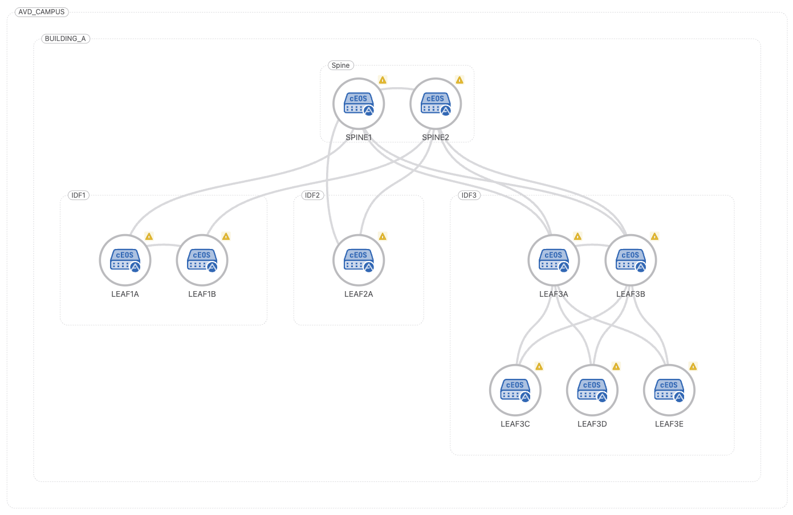

Figure 1 – Campus fabric topology generated and tagged by AVD


<br>
**Overview**

The `arista.avd.eos_designs` role can generate **CloudVision Tags** that are applied to devices and interfaces during fabric deployment. These tags are used by CloudVision to:

- Render accurate **Campus Topology views**
- Enable **tag-based searches and filters**
- Dynamically place devices into **Studio container hierarchies**
- Support **hybrid AVD + Studios workflows**

This functionality is supported on:

- **CloudVision as a Service (CVaaS)**
- **On-prem CloudVision 2024.3.0 or later**


<br>
**Documentation References**

- CloudVision Tags (AVD):  
  <https://avd.arista.com/5.7/ansible_collections/arista/avd/roles/eos_designs/docs/how-to/cloudvision-tags.html>

- Static Configuration Studio Deployment:  
  <https://avd.arista.com/5.7/ansible_collections/arista/avd/roles/cv_deploy/index.html#static-configuration-studio-deployment>

- Access Interface Configuration Studio (Quick Actions):  
  <https://www.arista.io/help/articles/provisioning-studios-built-in-access-interface#access-interface-configuration-studio>
  

<br>
**Enabling CloudVision Tag Generation**

To globally enable CloudVision tag generation for Campus fabrics, both of the following settings must be enabled:

```yaml
generate_cv_tags:
  topology_hints: true
  campus_fabric: true
```

These options allow AVD to generate the metadata required for:

- Campus topology rendering
- CloudVision Network Hierarchy UI activation
- Studio-based workflows


<br>
**CloudVision Network Hierarchy**

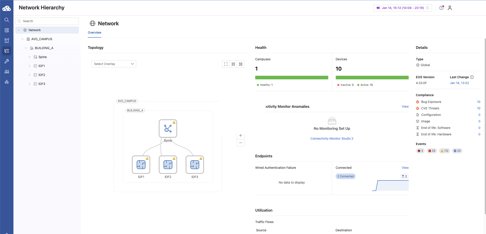

Figure 2 – CloudVision Network Hierarchy UI activated by Campus tags


<br>
**Campus Tag Variables**

AVD assigns CloudVision tags using fabric variables or node_type_keys.
The following variables are supported for Campus deployments:

| Variable                | Description                                       |
| ----------------------- | ------------------------------------------------- |
| `campus`                | Logical campus name                               |
| `campus_pod`            | Building or campus pod                            |
| `campus_access_pod`     | Access pod / IDF (not assigned to spines)         |
| `cv_tags_topology_type` | Campus node type (`spine`, `leaf`, `member-leaf`) |


<br>
**Example: Fabric Tag Assignment**

L3 Spine Configuration

```yaml
l3spine:
  defaults:
    campus: AVD_CAMPUS
    campus_pod: BUILDING_A
  node_groups:
    - group: SPINES
      cv_tags_topology_type: spine
```

L2 Leaf Configuration

```yaml
l2leaf:
  defaults:
    campus: AVD_CAMPUS
    campus_pod: BUILDING_A
  node_groups:
    - group: IDF1
      cv_tags_topology_type: leaf
      campus_access_pod: IDF1
    - group: IDF2
      cv_tags_topology_type: leaf
      campus_access_pod: IDF2
    - group: IDF3
      cv_tags_topology_type: leaf
      campus_access_pod: IDF3
    - group: IDF3_3C
      cv_tags_topology_type: member-leaf
      campus_access_pod: IDF3
```


<br>
**CloudVision Tags Applied to Devices**

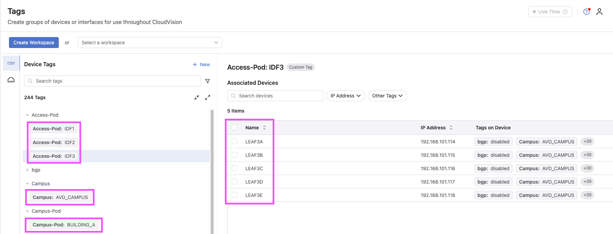

Figure 3 – CloudVision device view showing AVD-generated Campus tags


<br>
**Static Configuration Studio Using a Config Manifest**

A Static Configuration Studio can consume the CloudVision tags generated by AVD using a cv_static_config_manifest.

The manifest:

- Reads tags applied by arista.avd.eos_designs
- Uses tag_query expressions to dynamically place devices
- Builds a container hierarchy based on Campus structure
- Applies configlets to containers and inherited devices


<br>
**Example Static Config Manifest**

```yaml
cv_static_config_manifest:
  configlets:
    - name: Building_A_Banner
      file: configlets/Building_A_Banner.cfg

  containers:
    - name: ZZZ_AVD_CAMPUS
      description: AVD generated Campus Tag Hierarchy
      tag_query: "Campus:AVD_CAMPUS"
      match_policy: match_all

      sub_containers:
        - name: BUILDING_A
          description: Building A
          tag_query: "Campus-Pod:BUILDING_A"
          match_policy: match_all
          configlets:
            - name: Building_A_Banner

          sub_containers:
            - name: IDF1
              description: IDF 1
              tag_query: "Access-Pod:IDF1"
              match_policy: match_all
            - name: IDF2
              description: IDF 2
              tag_query: "Access-Pod:IDF2"
              match_policy: match_all
            - name: IDF3
              description: IDF 3
              tag_query: "Access-Pod:IDF3"
              match_policy: match_all
```


<br>
**Static Studio Container Hierarchy**

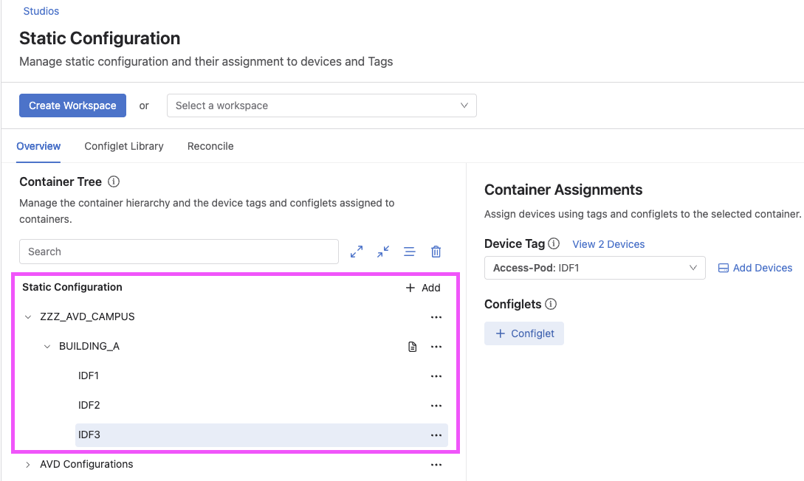

Figure 4 – Static Configuration Studio containers built from tag queries


<br>
**Deploying the Manifest with `cv_deploy`**

```yaml
tasks:
  - name: Deploy CloudVision configuration
    ansible.builtin.import_role:
      name: arista.avd.cv_deploy
    vars:
      ## Deploy full hierarchy of containers and configlets into CloudVision “Static Configuration Studio”
      cv_static_config_manifest:
        configlets:
          - name: "Building_A_Banner"
            file: configlets/Building_A_Banner.cfg
        containers:
          - name: ZZZ_AVD_CAMPUS
              description: "AVD generated Campus Tag Heiarchy"
              tag_query: "Campus:AVD_CAMPUS"
              match_policy: "match_all"
              sub_containers:
              - name: BUILDING_A
                  description: "Build A"
                  tag_query: "Campus-Pod:BUILDING_A"
                  match_policy: "match_all"
                  configlets:
                  - name: "Building_A_Banner"
                  sub_containers:
                  - name: IDF1
                      description: "IDF 1"
                      tag_query: "Access-Pod:IDF1"
                      match_policy: "match_all"
                  - name: IDF2
                      description: "IDF 2"
                      tag_query: "Access-Pod:IDF1"
                      match_policy: "match_all"
                  - name: IDF3
                      description: "IDF 3"
                      tag_query: "Access-Pod:IDF1"
                      match_policy: "match_all"
```

AVD performs the following actions:

- Uploads configlets into the Configlet Library
- Creates the Studio container hierarchy
- Places devices based on tag queries
- Applies configlets to all matching devices


<br>
**Root Container Ordering Behavior**

When deploying or adding new root containers, the `cv_deploy` role places all AVD-managed root containers at the top of the Studio container tree.

**Note**
This automated behavior may reorder containers that were manually arranged in the UI.


<br>
**Configlet Inheritance Example**

This section illustrates how **AVD manages configlets** and how those configlets are inherited by devices through a **Static Configuration Studio container hierarchy**.

The workflow is as follows:

1. AVD references a raw `.cfg` configlet file from the repository.
2. The configlet is declared in the `configlets` section of the Static Studio manifest.
3. The configlet is associated with the appropriate container in the manifest hierarchy.
4. CloudVision applies the configlet to all devices that match the container’s tag query.


<br>
**AVD Configlet Declaration in the Manifest**

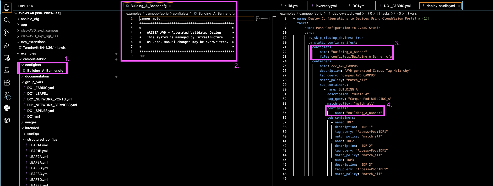

AVD references the raw configuration file and includes it in the manifest so it can be managed by CloudVision.


<br>
**Configlet Deployed to the CloudVision Library**

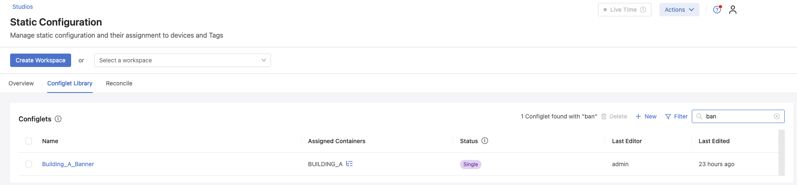

During the `cv_deploy` phase, AVD uploads the configlet into the CloudVision Configlet Library.


<br>
**Configlet Associated with the Studio Container**

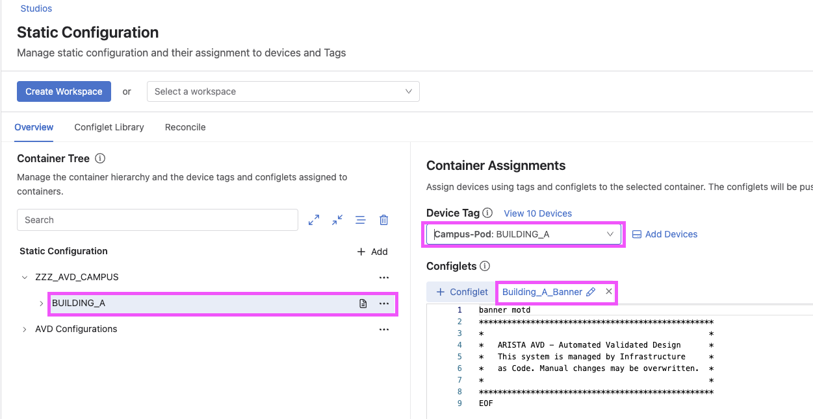

The configlet is attached to a Static Studio container.  
All devices assigned to this container automatically inherit the configlet.


<br>
**Summary**

By combining:

- AVD-generated CloudVision Campus tags
- Static Studio manifests
- Tag-based container placement

You gain a scalable, deterministic, and supportable integration between AVD and CloudVision Studios, while maintaining clear ownership boundaries between build-time automation and day-2 operations.

<br>
**Day-2 Operations (CloudVision Campus)**

This section focuses on **Day-2 operational workflows** using the **CloudVision Campus UI**, with emphasis on how network operators interact with the platform *after* Day-1 provisioning has been completed by AVD.

Unlike Day-1 automation, where AVD is the source of truth, Day-2 operations leverage **CloudVision Studios, Network Hierarchy, and Quick Actions** to safely make operational changes at scale.

- Access Interface Configuration Studio (Quick Actions):  
  <https://www.arista.io/help/articles/provisioning-studios-built-in-access-interface#access-interface-configuration-studio>


<br>
**Entry Point: Campus Health Overview**

For network operators assigned a **Campus profile**, the default landing page after logging into CloudVision is the **Campus Health Overview** dashboard.

This dashboard provides:

- High-level campus health status
- Visibility into wired and wireless domains
- Direct navigation into Campus-specific operational workflows

<!-- Image: Campus Health Overview Dashboard -->

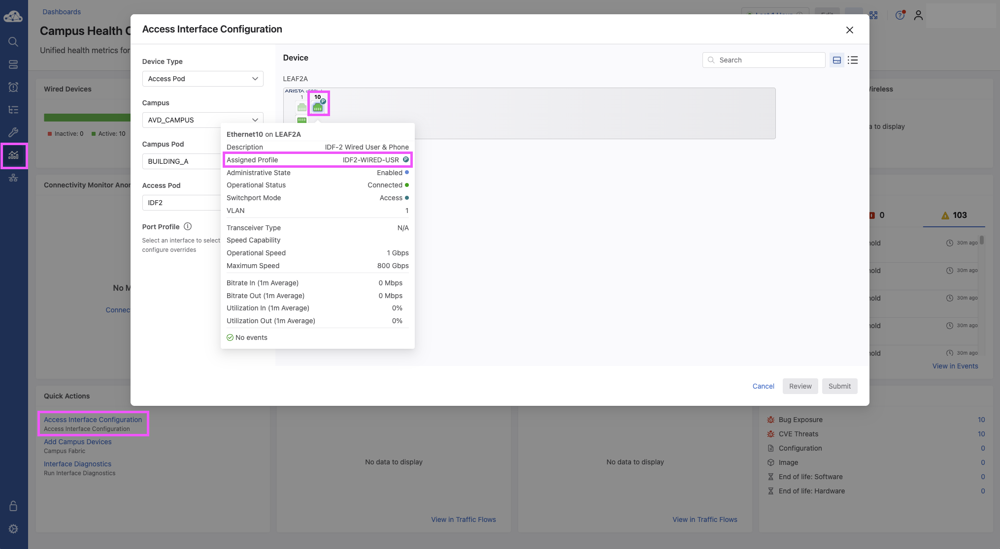

From this view, operators can quickly pivot from monitoring to action without navigating away from the Campus workflow context.


<br>
**Navigating the Network Hierarchy**

From the **Campus Health Overview**, operators can navigate to the **Network Hierarchy UI**, which represents the logical campus structure built using **AVD-generated CloudVision Campus tags and containers**.

The Network Hierarchy enables operators to:

- View sites, buildings, floors, and other logical groupings
- Understand configuration and policy inheritance scopes
- Target operational changes with precision and confidence

Quick Actions menus are accessible **per container**, directly reflecting the underlying **tag-based hierarchy** created during Day-1 deployment.

Within the Quick Actions workflow, the UI presents a **front-panel view of the switch**, allowing operators to **single-select or multi-select switchports** and assign them to predefined port profiles.

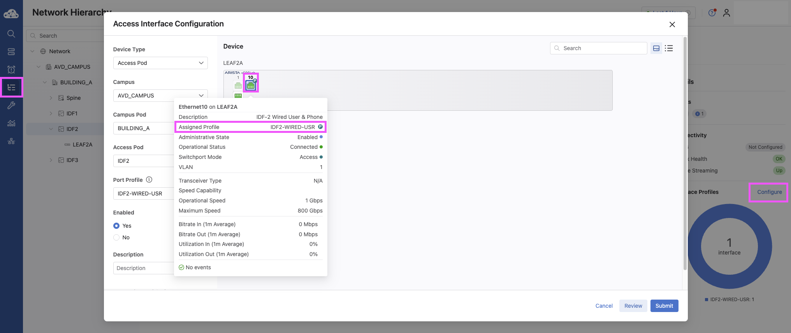

Because configuration and policies are associated at the container level, hierarchy placement directly determines what devices inherit.


<br>
**Quick Actions: Operational Changes at Scale**

Within the Campus workflow, operators can launch **Quick Actions** directly from the Campus dashboards or Network Hierarchy views.

One of the most common Day-2 use cases is **setting or updating switch port profiles**.

Quick Actions allow operators to:

- Select one or more devices or ports
- Apply predefined port profiles
- Execute changes without modifying AVD source files

<br>
**Example: Applying Switch Port Profiles**

Using Quick Actions, an operator can:

1. Select a container, device, or specific interfaces
2. Choose the appropriate **Switch Port Profile**
3. Review the proposed change
4. Execute the action through CloudVision

This workflow ensures:

- Consistency across the campus
- Reduced operational risk
- Fast response to Day-2 requirements

<!-- Image: Quick Actions Port Profile Selection -->

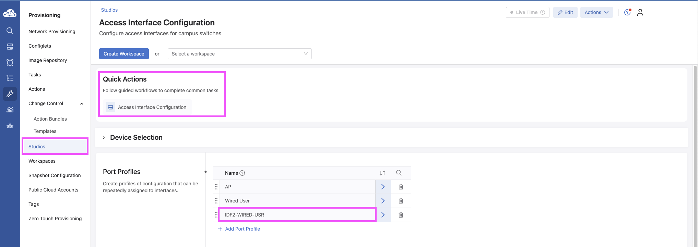


<br>
**Key Takeaways for Day-2 Operations**

- **AVD remains the Day-1 source of truth**
- **CloudVision enables controlled Day-2 changes**
- Network Hierarchy and tags define operational scope
- Quick Actions provide safe, repeatable workflows for operators

This separation allows infrastructure teams to maintain strong automation discipline while empowering operations teams with the flexibility required for daily campus management.


<br>
**About This Repository**

This repository contains personal lab work and reference material created to explore hybrid AVD and CloudVision Campus workflows.  

It is not official Arista documentation or a supported design guide.


---

## __*Upcoming Events*__  
Arista hosts various events throughout the year for you! Members of our team organize these informative events to showcase Arista's ability to not only help improve your network, but to also assist by providing a set of tools to improve your operations!  

Click on the boxes below to be directed to Arista's website for additional lists of Webinars and Events.


<div class="grid cards" markdown>

-   __Webinars__  

    --- 

    We make it easy for you to view products that are of interest, all virtually! Technical members of the team showcase outstanding explanations of the products. Click below to see our list of Webinars. 

    [Arista Webinars](https://www.arista.com/en/company/news/webinars){.md-button target="_blank"}

-   __Events__ 

    ---
    Join us in person to get a closer look at our list of products and solutions, as well as get the chance to meet members of the team. Click below to see our list of upcoming Events. 

    [Upcoming Events](https://www.arista.com/en/company/news/events){ .md-button target="_blank" }


</div>

--- 

## __*Software Updates*__


*Stay informed on the latest software updates across all Arista products and services.*

|  Software    | Version      |  Release Date |
| :-----------: | :-----------: | :-----------: |
| __EOS__           | 4.36.0F <br> 4.35.3.1F <br> 4.35.3F <br> 4.23.10M | April 9th, 2026 <br> April 8th, 2026 <br> March 20th, 2026 <br> March 2nd, 2026 |
| __CVP__           | Portal 2026.1.0 <br> Appliance 7.1.0 <br> Sensor 1.3.0 | March 30th, 2026 <br> September 2nd, 2025 <br> December 5th, 2025 |
| __DMF__           | 8.6.3 | March 18th, 2026 |
| __CV-CUE__         | 21.0.0 | January 16th, 2026 |
| __Arista NDR__     | 5.3.5 | July 16th, 2025 |
| __TerminAttr__     | 1.42.1 | February 4th, 2026 |
| __VeloCloud SD-WAN__ <br>Orchestrator/Gateway/Edge | 6.4.1 | December 19th, 2025 |

[View All Latest Software Updates](https://www.arista.com/en/support/software-download){: .md-button .md-button--primary target="_blank" }


---

## __* Security Advisories and Field Notices*__


*Stay informed on the latest platform security and field notice updates.*

### **Security Advisories**
* **runC** — [Security Advisory 0135](https://www.arista.com/en/support/advisories-notices/security-advisory/23784-security-advisory-0135){: target="_blank" } <br> *(April 7th, 2026)*

### **Field Notices**
* **CV-CUE Release Process** — [Field Notice 0125](https://www.arista.com/en/support/advisories-notices/field-notice/23698-field-notice-0125){: target="_blank" } <br> *(March 11th, 2026)*

<br>

[View All Latest Advisories & Notices](https://www.arista.com/en/support/advisories-notices){: .md-button .md-button--primary target="_blank" }

---


## __* Product Updates*__


*Stay up to date on all new Arista Product Releases, as well as End of Sale/End of Support Notices.*

### **New Product Releases** * **Q1 2026** — [Ask AVA - CloudVision as a Service (beta feature)](https://www.arista.io/help/articles/overview-core-tools-ask-ava){: target="_blank" }

###  **End of Sale / End of Software Support**
* **April 10th, 2026** — [CloudVision Portal 2024.3 Release Train](https://www.arista.com/en/support/advisories-notices/end-of-support/23791-end-of-software-support-for-cloudvision-portal-2024-3-release-train){: target="_blank" } 
* **April 10th, 2026** — [DCS-7280CR3K-36S Series Switches](https://www.arista.com/en/support/advisories-notices/end-of-sale/23790-end-of-sale-of-the-arista-dcs-7280cr3k-36s-series){: target="_blank" } 
* **April 10th, 2026** — [DCS-7280CR3K-48YC8 Series Switches](https://www.arista.com/en/support/advisories-notices/end-of-sale/23789-end-of-sale-of-the-arista-dcs-7280sr3k-48yc8-series){: target="_blank" } 
* **April 10th, 2026** — [DCS-7280CR3K-32P4, DCS-7280CR3K-32D4, DCS-7280CR3MK-32P4 Series Switches](https://www.arista.com/en/support/advisories-notices/end-of-sale/23788-end-of-sale-of-the-arista-dcs-7280cr3k-32p4-dcs-7280cr3k-32d4-and-dcs-7280cr3mk-32p4-series){: target="_blank" }
* **March 13th, 2026** — [EOS-4.30 Release Train](https://www.arista.com/en/support/advisories-notices/end-of-support/23728-end-of-software-support-for-eos-4-30){: target="_blank" } 

<br>

[View All Latest End of Sale & Support Notices](https://www.arista.com/en/support/advisories-notices/endofsale){: .md-button .md-button--primary target="_blank" }


---

## Don't Forget! 
Arista has revamped their certifications! The new **Arista Certified Engineer (ACE)** program is now organized by specific tracks like Cloud Data Center, Campus, and Automation to better align with your job role.


[Start your ACE journey now](https://www.training.arista.com/){ .md-button .md-button--primary target="_blank" }

---


---
## *Your Southwest Regional Team is Here to Support Your Success.* 


---
<div style="background-color: #f8f9fa; border-left: 5px solid #004a99; padding: 20px; margin-top: 30px;">
  <h3 style="color: #004a99; margin-top: 0;">Let's Connect</h3>
  <p>Thanks for reading! Your local Arista team is here to help you navigate your evolving network needs. Reach out anytime to southwest@arista.com for more information or technical guidance. Until next month—stay connected!</p>
  <a href="mailto:southwest@arista.com" class="md-button md-button--primary">Contact Your Local Team</a>
</div>