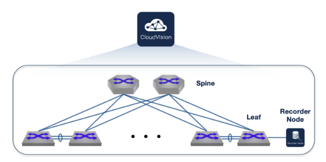

# Arista Southwest Region Newsletter

Welcome to the September 2026 Newsletter for Arista customers in the U.S. Southwest Region! 

We welcome your feedback on the newsletter. If you have any ideas or suggestions on how to improve the newsletter, please reach out to [southwest@arista.com](mailto:southwest@arista.com){: target="_blank" }.  

---

## Leadership Perspectives — Recent Blogs from Arista Leadership

-   **The Next Frontier for AI Fabrics: Scale Across Networking**
    ---
    *Sep 22nd, 2026: Jayshree Ullal and Brendan Gibbs introduce Arista's Scale-Across strategy and REACH framework, demonstrating how the 7800 AI Spine and SRv6 unite geographically distributed data centers to bypass local power and space constraints for massive AI workloads.*
    
    [Read Blog](https://blogs.arista.com/blog/the-next-frontier-for-ai-fabrics-scale-across-networking){: target="_blank" }

-   **Racing Against Machine-Speed Threats: How Arista Is Using AI**
    ---
    *Sep 2nd, 2026: Kenneth Duda and Jason Bevis detail how Arista combines AI-assisted code analysis with fundamental EOS architectural advantages—like a single codebase and control-plane isolation—to neutralize security threats at machine speed.*
    
    [Read Blog](https://blogs.arista.com/blog/racing-against-machine-speed-threats){: target="_blank" }

[Explore All Blogs](https://blogs.arista.com/blog){: target="_blank" }

---

## Southwest Region Tech Tip of the Quarter

!!! info "Your new network colleague: Ask AVA"
    

    Tired of clicking through multiple dashboards to piece together a troubleshooting picture? 
    
    Meet **Ask AVA**, your new CloudVision AI colleague that allows you to interact with your network using natural language.
    
    **Why it matters:** Ask AVA leverages your high-quality data in Arista's Network Data Lake (NetDL) to answer specific questions about your network. Instead of manually correlating MAC addresses and routing tables across different screens, you can simply ask AVA to summarize active network events, generate CPU and memory visualizations, or even run `ping` and `traceroute` commands directly from impacted devices.
    
    **Pro Tip:** You can enable Ask AVA (currently in Beta) by navigating to the **Settings > Features** tab in your CVaaS tenant. Once enabled, click the **"A"** icon in the top right corner of any CloudVision screen to open the chat interface. If you are logging in after a long weekend, try starting with: "Create a list of Events that have occurred over the last 24 hours and recommend which events I should address first."

    Check out last month's Newsletter to learn more about Ask AVA! To view, select "March 2026" in the top left navigation menu.
    

---
## Featured Articles

###  Integrated Packet Capture for Modern Arista Networks
By: Gurinder Sandhu, Systems Engineer
 

Even with today’s advances in AI and automation, there are times when network engineers still need to examine exactly what is happening on the wire. Whether troubleshooting is performed by a human operator or assisted by AI, packet captures remain one of the most valuable tools for diagnosing complex network behavior.

That need for packet-level visibility remains important in modern EVPN/VXLAN spine-and-leaf networks, where traffic can traverse multiple paths across a distributed fabric. Arista is now extending that architecture with troubleshooting capabilities that are deeply integrated into the network itself.

 

**Packet Capture as Part of the Network**

The Arista Recorder Node enables packet capture from switches throughout an Arista environment. Rather than deploying separate packet-capture infrastructure at multiple locations, a Recorder Node can be connected to the network and used as a centralized destination for captures from across the fabric.

Operations are managed through Arista CloudVision, providing a common platform for both network management and packet-capture workflows.

 

<figure markdown="span">
  
  <figcaption>Recorder Node Integration into the Leaf - Spine Topology</figcaption>
</figure> 

 

In a typical spine-and-leaf topology, the Recorder Node can be connected to a leaf switch. From CloudVision, an operator can initiate a packet capture on any spine or leaf switch, and the captured traffic is automatically transported to the Recorder Node using GREenSPAN tunnels for storage and analysis.

When broader visibility is required, packet captures can also be initiated from multiple switches simultaneously.

 
**Capture Once, Analyze What Matters**

Once packets have been captured, operators can retrieve the complete capture as a PCAP file or export a filtered set of packets using specific criteria. For example, filtering can be based on:

* A specific time range
* A particular capture session
* Source or destination networks
* Other supported filtering criteria

This keeps exported PCAP files manageable, while the complete capture remains available on the Recorder Node.

 

**Simplifying Network Troubleshooting**

The goal is simple: make packet capture a native capability of the network rather than a separate operational process.

Recorder Node is an integrated part of the Arista network and is managed through the same CloudVision platform used to operate the spine-and-leaf network. This gives network teams a single platform for network management and packet capture, with both operational workflows built directly into CloudVision.

Let us show you how Arista is making networks smarter with integrated tools designed to simplify monitoring, troubleshooting, and packet-level visibility. To learn more, click on the link below. 

* [CloudVision-driven Recorder Node](https://www.arista.io/help/2026.2/articles/devices-recorder-nodes ){ target="_blank" }

---
 

## __*Upcoming Events*__  
Arista hosts various events throughout the year for you! Members of our team organize these informative events to showcase Arista's ability to not only help improve your network, but to also assist by providing a set of tools to improve your operations!  

Click on the boxes below to be directed to Arista's website for additional lists of Webinars and Events.

-   __Webinars__  

    --- 

    We make it easy for you to view products that are of interest, all virtually! Technical members of the team showcase outstanding explanations of the products. Click below to see our list of Webinars. 

    [Arista Webinars](https://www.arista.com/en/company/news/webinars){.md-button target="_blank"}

-   __Events__ 

    ---
    Join us in person to get a closer look at our list of products and solutions, as well as get the chance to meet members of the team. Click below to see our list of upcoming Events. 

    [Upcoming Events](https://www.arista.com/en/company/news/events){ .md-button target="_blank" }

--- 

## __*Software Updates*__

*Stay informed on the latest software updates across all Arista products and services.*

|  Software    | Version      |  Release Date |
| :-----------: | :-----------: | :-----------: |
| __EOS__           | 4.35.6M   4.34.8M   4.33.10M   4.36.2F | August 18th, 2026   August 18th, 2026   August 18th, 2026   August 15th, 2026 |
| __CVP__           | Portal 2026.2.1   Appliance 7.2.0   Sensor 1.4.2 | September 9th, 2026   July 2nd, 2026   July 8th, 2026 |
| __DMF__           | 8.10.1 | September 18th, 2026 |
| __CV-CUE__         | 2026.2.0 | May 21st, 2026 |
| __Arista NDR__     | 5.3.5 | July 16th, 2025 |
| __TerminAttr__     | 1.45.1 | July 10th, 2026 |
| __VeloCloud SD-WAN__  Orchestrator/Gateway/Edge | 7.0.0 | July 2026 |

[View All Latest Software Updates](https://www.arista.com/en/support/software-download){: .md-button .md-button--primary target="_blank" }

---

## __* Security Advisories and Field Notices*__

*Stay informed on the latest platform security and field notice updates. For more information on Arista's statement on AI-Enhanced Security and Resilience regarding Mythos and project Glasswing, [click here.](https://www.arista.com/assets/data/pdf/glasswing/QA-Project-Mythos-Glasswing.pdf){: target="_blank" }*

### **Security Advisories**
* To View the **Latest Arista PSIRT Advisories**, click the following link — [Arista PSIRT Advisories](https://www.arista.com/en/support/advisories-notices){: target="_blank" }   

 

* **Are you a CloudVision Customer?** Leverage the following workflow to remediate PSIRTs affecting your EOS devices   
       - Configure **Event Notifications** to be alerted as new PSIRTs are released — [CloudVision Event Notifications](https://www.arista.io/help/articles/events-configure-notifications){: target="_blank" }  
       - View the **Compliance Dashboard** to see a list of impacted devices, an overview of each CVE, and remediation next steps — [CloudVision Compliance Dashboard](https://www.arista.io/help/articles/devices-compliance-bug-cve){: target="_blank" }  
       - Upgrade EOS devices using the **Software Management Studio** to resolve threats from impacted devices — [CloudVision Software Management Studio](https://www.arista.io/help/articles/provisioning-studios-built-in-software){: target="_blank" }      

 

* **Not a CloudVision Customer?** Leverage the Arista ANTA PSIRT CLI workflow to generate a report that illustrates which CVEs are impacting your devices — [ANTA PSIRT CLI Feature](https://anta.arista.com/stable/security-advisory/usage/){: target="_blank" }   
       - Visit **Labs.Arista.com** to try out the ANTA PSIRT CLI Feature Today — [ANTA PSIRT Assessment Lab](https://labs.arista.com/labs#tech-lib-tab-no-module){: target="_blank" }  
 

### **Field Notices**
* **C-200 AP on firmware 21.4.0M-12** — [Field Notice 135](https://www.arista.com/en/support/advisories-notices/field-notice/24501-field-notice-0135){: target="_blank" }   *(August 19th, 2026)*
* **Deprecation of EOS SWAG rpr Redundancy Mode** — [Field Notice 134](https://www.arista.com/en/support/advisories-notices/field-notice/24450-field-notice-0134){: target="_blank" }   *(August 18th, 2026)*
* **CloudVision Cluster Replay CLI Commands** — [Field Notice 133](https://www.arista.com/en/support/advisories-notices/field-notice/24406-field-notice-0133){: target="_blank" }   *(August 6th, 2026)*

 

[View All of the Latest Advisories & Notices](https://www.arista.com/en/support/advisories-notices){: .md-button .md-button--primary target="_blank" }

---

## __* Product Updates*__

*Stay up to date on all new Arista Product Releases, as well as End of Sale/End of Support Notices.*

### **New Product Releases** 
* **Q2 2026** — [Ask AVA - CloudVision as a Service (beta feature)](https://www.arista.io/help/articles/overview-core-tools-ask-ava){: target="_blank" }

###  **End of Sale / End of Software Support**
* **September 17th, 2026** — [DCA-NDA-S100MB](https://www.arista.com/en/support/advisories-notices/end-of-sale/24757-end-of-sale-of-the-arista-dca-ndr-s10){: target="_blank" }

 

[View All Latest End of Sale & Support Notices](https://www.arista.com/en/support/advisories-notices/endofsale){: .md-button .md-button--primary target="_blank" }

---

## Did You Know? 
Arista has revamped their certifications! The new **Arista Certified Engineer (ACE)** program is now organized by specific tracks like Cloud Data Center, Campus, and Automation to better align with your job role.

[Start your ACE journey now](https://www.training.arista.com/){ .md-button .md-button--primary target="_blank" }

---

---
## *Your Southwest Regional Team is Here to Support Your Success.* 

---

  <h3 style="color: #004a99; margin-top: 0;">Let's Connect</h3>
  
Thanks for reading! Your local Arista team is here to help you navigate your evolving network needs. Reach out anytime to southwest@arista.com for more information or technical guidance. Until next month—stay connected!

  <a href="mailto:southwest@arista.com" class="md-button md-button--primary">Contact Your Local Team</a>

